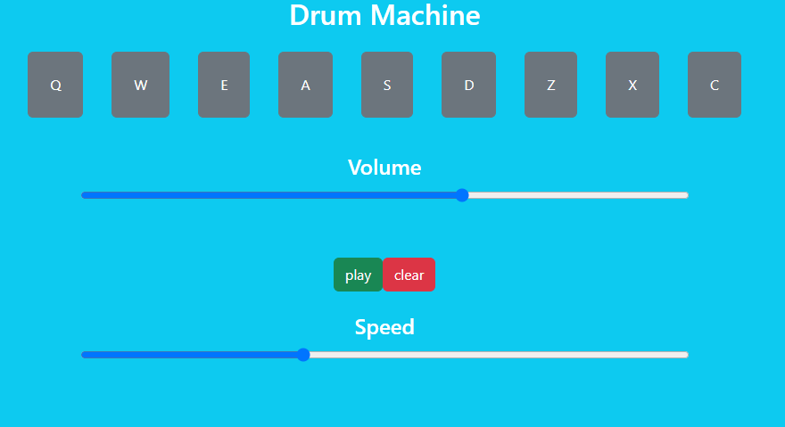

# Drum-Machine
** Simple Drum Machine + Recording **

You Could Try [Drum Machine Recorder - Live Demo](https://mo3110.github.io/drum_machine_recorder.github.io/)

<picture>
 
</picture>

* The provided code is a React.js application that implements a simple drum machine with nine different audio clips that can be played by clicking the corresponding buttons or using keyboard keys. The application also allows the user to adjust the volume and speed of the audio clips, as well as record and play back a sequence of audio clips.

* The audio clips are defined as an array of objects, with each object containing a key code, key trigger, ID, and URL for the audio file. These objects are mapped over in the App component to create the individual drum pad buttons. The Pad component handles the logic for playing the audio clips and updating the recording.

* The App component maintains state for the volume, recording, and speed using the React useState hook. The volume and speed values are updated using input range sliders, while the recording is updated by concatenating the key trigger values of the played audio clips into a string.

* The playRecording function in the App component uses the recording string to play back the recorded audio clips at the selected speed. This is done using setInterval to play each audio clip at the specified interval, with clearInterval used to stop the playback when all audio clips have been played.
